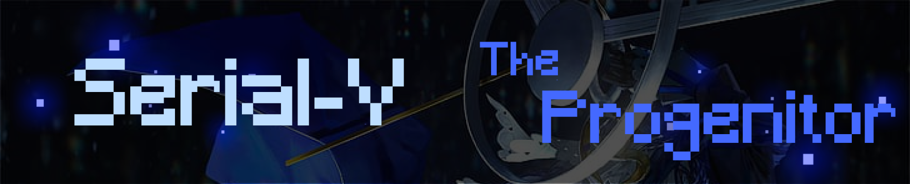

  

<h2 align="center">
  <a href="https://realmbot.dev/">Realm Bot</a> |
  <a href="https://realmhub.org/">Realm Hub</a> |
  <a href="https://mcbe.news/">MCBE News</a>
</h2>

Hey! I'm Serial-V, a full-stack developer who spends most of my time building things around Minecraft: Bedrock Edition, Discord, and the infrastructure behind them. I primarily work with TypeScript and Node.js, ranging from low-level protocol implementations to backend services and web applications.

Most of my work revolves around:

- [Realm Bot](https://realmbot.dev/), a Minecraft: Bedrock Edition Discord bot built to provide management, moderation, automation, and other tooling for Realms.
- [Realm Hub](https://realmhub.org/), a platform for discovering and sharing Minecraft: Bedrock Edition Realms and servers.
- [MCBE News](https://mcbe.news/), a site focused on news, updates, and information surrounding Minecraft: Bedrock Edition.

Most of my projects may be found here or under the [Realm Bot](https://github.com/Realm-Bot). Feel free to look around but there may not be any yet.

If you need to contact me, you can by joining either [Realm Bot](https://discord.gg/realmbot) or [Realm Hub](https://discord.gg/realmhub).

---

  
    Yesterday mourns you. Tomorrow awaits you. I remain.
  

